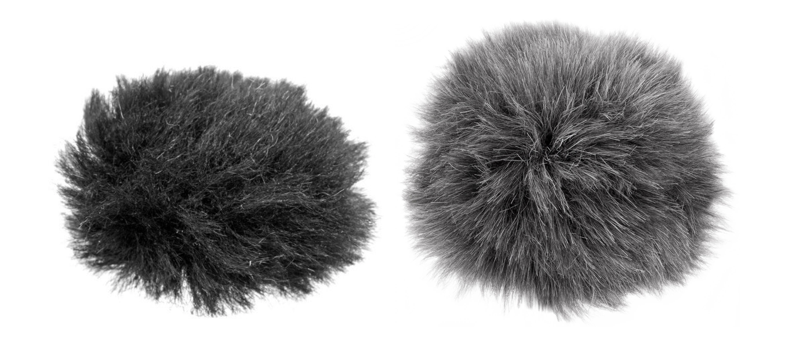

# fuzzy-match

A Clojure library for fuzzy matching two strings

This library is not deployed Clojars so instead can be installed from the latest git SHA using tools.deps.

## Purpose

This is a reference solution for a Clojure learning exercise.

The challenge of this exercise is to write a library that does fuzzy sring matching by combining two algorithms:
 - Levenshtein distance
 - Splitting one of the specified strings on a series of specified chars and permuting the parts.
 
 The Levenshtein distance is then calculated between the first string and each of the rearrangements of the second and the minimum Levenshtein distance returned.
 
 Please see the `fuzzy-match` function in the `fuzzy-match.core` namespace.
 
 
 ## License
 
 This library is offered under the MIT license.
